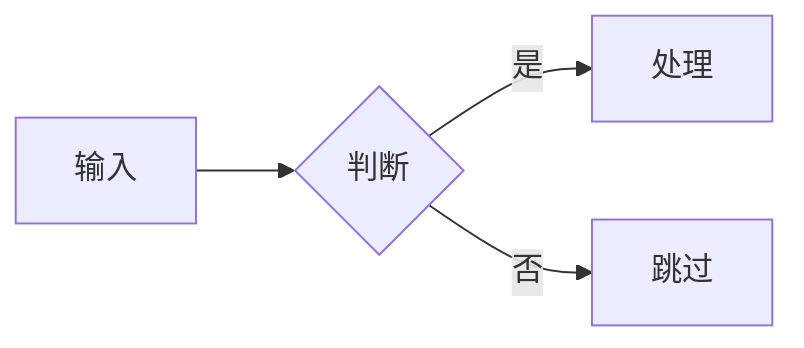
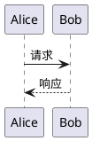

# Extended Markdown syntax

Everything below is wired in `astro.config.mjs` (`markdown.processor` remark/rehype lists)
plus `src/config/*`. Only use a feature when it genuinely helps the reader — an
"optimisation" pass that converts every sentence into a callout is worse than the original.

## Headings and table of contents

`##`–`######` only. The layout renders the frontmatter `title` as the page `<h1>`, so a body
`#` duplicates it and corrupts the TOC. Heading anchors and the TOC are generated from
`rehype-slug` + `rehype-autolink-headings`, so headings need no manual ids.

## Callouts (admonitions)

`rehype-callouts` is configured with `theme: "github"` (`src/config/siteConfig.ts`), so only
these five types are styled:

```markdown
> [!NOTE]
> 补充说明。

> [!TIP]
> 更省事的做法。

> [!IMPORTANT]
> 必须知道的关键信息。

> [!WARNING]
> 可能出问题的操作。

> [!CAUTION]
> 会造成负面后果的操作。
```

A custom title goes after the marker: `> [!NOTE] 自定义标题`.
The `> [!TYPE]-` (collapsed) and `> [!TYPE]+` (expanded) variants are supported by
`rehype-callouts` but are unused in this repo. Type names are case-insensitive.

The Docusaurus container form is **equivalent** — `src/plugins/remark-directive-rehype.js`
rewrites any container directive whose name is in `ADMONITION_TYPES` (26 names) into a
`blockquote` with `[!TYPE]` injected, so `rehype-callouts` treats both identically:

```markdown
:::note
突出显示用户应该考虑的信息。
:::

:::tip[自定义标题]
可选信息，帮助用户更成功。
:::
```

Two caveats on the `:::` form: `{attrs}` are discarded (`delete node.data.hProperties`), so
only the `[label]` title survives; and since the container is closed by any `:::` line, a
`::: code-group` inside a `:::tip` will terminate the callout. Use the `> [!TYPE]` form when
you need to nest, or when the content contains `:::` blocks.

Either way the vocabulary is limited by `theme: "github"`: `abstract`, `summary`, `tldr`,
`info`, `todo`, `success`, `danger`, `bug`, `example`, … all convert to `[!THAT]` and then
render as a **plain blockquote** (`rehype-callouts` only matches the five types). They are not
errors — they just silently lose the callout styling. The full Obsidian list requires
`theme: "obsidian"` in `src/config/siteConfig.ts` (and a dev-server restart).

Python-Markdown `!!!`/`???` admonitions are **disabled**
(`siteConfig.post.rehypeCallouts.enablePythonMarkdownAdmonitions === false`) and render as
literal text.

Use a callout where a note genuinely interrupts the flow — a caution about destructive
commands, a caveat about an unstable API. Not for ordinary prose.

## Code blocks (Expressive Code)

Always give the fence a language. Language badge is enabled
(`expressiveCodeConfig.pluginLanguageBadge.enable`); the language logo is disabled.

````markdown
```typescript title="src/utils/url-utils.ts" showLineNumbers startLineNumber=5
export function getPostUrlBySlug(slug: string): string { /* ... */ }
```
````

| Meta option | Effect |
|---|---|
| `title="…"` | Frame title bar (a first-line HTML comment also becomes the title) |
| `frame="none"` / `frame="code"` | Terminal vs. code frame |
| `showLineNumbers` / `showLineNumbers=false` | Line numbers on/off |
| `startLineNumber=N` | Numbering offset |
| `{1,3-5}` | Highlight lines |
| `ins={2}` / `del={3}` / `mark={4}` | Inserted / deleted / marked lines |
| `{"label":5}` `ins={"b":7-8}` | Labeled markers |
| `"some text"` / `/regex/` | Mark matching inline text |
| `wrap` / `wrap=false` / `wrap preserveIndent=false` | Soft-wrap (off by default) |
| `collapse={5-12}` | Collapse a *section* of lines |
| `nocollapse` | Opt a long block **out** of automatic whole-block collapsing |
| `collapseStyle=github\|collapsible-start\|collapsible-end\|collapsible-auto` | Section collapse presentation |
| `diff` / `diff lang="js"` | Diff rendering |

Verified in-repo: `code-examples.md` exercises every row above
(e.g. `code-examples.md:312` uses ```` ```js showLineNumbers startLineNumber=5 ````).

Two options are easy to confuse: a **bare** `collapse` collapses the whole block (the
`expressive-code-collapsible` plugin), while `collapse={a-b}` collapses only those lines
(`@expressive-code/plugin-collapsible-sections`). No post currently uses either.

Code blocks longer than **15 lines** are auto-collapsed with an 8-line preview
(`expressiveCodeConfig.pluginCollapsible`). That is automatic — do not fight it by splitting
code, and add `nocollapse` only when the block must be fully visible.

Common fence languages in this repo: `html`, `text`, `bash`, `markdown`, `typescript`,
`yaml`, `json`, `diff`, `python`, `plantuml`, `mermaid`. Use `text` for bare URLs and
terminal transcripts.

## Tabbed code groups

`rehype-code-group` renders `::: code-group` containers as tabs. Note the **space after
`:::`** (which is what keeps it from being parsed as a directive) and the mandatory `labels=`
with one entry per fenced block, in order:

````markdown
::: code-group labels=[npm, pnpm, yarn]

```bash
npm install rehype-code-group
```

```bash
pnpm add rehype-code-group
```

:::
````

The closing line must be exactly `:::` on its own. VitePress `===` separators are **not**
supported. A code group **cannot be nested inside a `:::` callout** — the inner `:::` closes
the outer container; use the `> [!TYPE]` callout form instead if you need both.

Use it for genuinely equivalent alternatives (package managers, languages, OSes) — not as a
container for unrelated snippets. No post in this repo uses code groups yet.

## Math (KaTeX)

`remark-math` + `rehype-katex`, with the mhchem extension loaded (`\ce{}` for chemistry).

```markdown
行内公式 $E = mc^2$，行间公式：

$$
\int_0^\infty e^{-x^2}\,dx = \frac{\sqrt{\pi}}{2}
$$
```

KaTeX CSS is loaded only on article pages (`KatexManager`). See
`src/content/posts/katex-math-example.md` for a working set.

## Mermaid diagrams

Fence as `mermaid`. `remark-mermaid` swaps the fence for a client-rendered diagram, and
`rehype-diagram-panzoom` adds pan/zoom.

````markdown

````

## PlantUML diagrams

Fence as `plantuml`. Rendered server-side via `plantuml-encoder` + the configured server
(`plantumlConfig`), with a light/dark theme switcher.

````markdown

````

Diagrams get pan/zoom and are excluded from the `figure` treatment.

## Internal links and post cards (wiki links)

`remark-wiki-link` (Obsidian syntax). Targets resolve in this order: frontmatter `slug`,
exact content path, then a bare file name accepted only when unique. Extensions are optional.

```markdown
[[firefly]]                       <!-- alone in a paragraph → rich link card -->
[[firefly|显示文字]]               <!-- card with a custom title -->
请参阅 [[firefly]] 了解主题特性。    <!-- inline → plain link, text = target's title -->
[[firefly#功能]]                   <!-- heading anchor → always a plain link -->
```

An alias that merely repeats the target (`[[guide/foo|foo]]`, what Obsidian inserts by
itself) is ignored, and the real title wins.

Prefer wiki links over hand-written `/posts/...` URLs: they survive URL changes as long as the
target is reachable by slug, path or unique file name. See
`src/content/posts/guide/firefly-wiki-link.md`.

`[[…]]` inside inline code or a fenced block is left literal — that is how the tutorial
documents the syntax. It is never rewritten inside an existing link (`[[x]](url)`).

## Image grid

`remark-image-grid` wraps images between `[grid]` and `[/grid]`. Column count follows the
image count (capped at 4); it works inside callouts, blockquotes and lists too.

```markdown
[grid]


[/grid]
```

## Image captions and figures

`rehype-figure` turns any image with a **non-empty `alt`** into
`<center><figure><figcaption>alt</figcaption></figure></center>` — the alt text becomes a
visible caption. So:

- Write a real caption in `alt` when the image deserves one.
- Use `` / `alt=""` when it does not, to avoid an empty caption block.

`rehype-image-referrerpolicy` adds `referrerpolicy="no-referrer"` for hosts listed in
`siteConfig.imageOptimization.noReferrerDomains` — this is why some hot-linked images 403
without it.

## GitHub repository card

```markdown
::github{repo="CuteLeaf/Firefly"}
```

Fetches repository data at page load. Do not put it inside a callout or a code fence.

## Spoiler

```markdown
内容 :spoiler[被隐藏了 **哈哈**]！
```

Inline directive; the inner text still supports Markdown.

## Video / arbitrary HTML

Raw HTML blocks pass through. Copy the platform's embed code:

```html
<iframe width="100%" height="468" src="https://www.youtube.com/embed/VIDEO_ID"
  title="YouTube video player" frameborder="0" allowfullscreen></iframe>
```

## Links, e-mail

- External `http(s)` links automatically get `target="_blank"` and
  `rel="noopener noreferrer"`; same-host links are left alone. Write normal Markdown links.
- `mailto:` links are rewritten into a base64-obfuscated element that decodes on click.
  Write `[写信给我](mailto:me@example.com)`; do not paste a bare address as a link target
  you expect to remain plain.

## Tables

Standard GFM. The delimiter row must contain a pipe per column — a bare `---` under a table
row is a thematic break or a setext heading, not a separator:

```markdown
| 参数 | 说明 |
| --- | --- |
| `limit` | 返回条数 |
```

## Excerpt and reading time

- `remark-excerpt` sets the card excerpt to the **first paragraph** — used only when
  `description` is empty. There is **no** `<!-- more -->` marker in this theme.
  A leading `[grid]` block makes the excerpt the concatenated alt texts, and a leading
  `:::tip` is skipped because only top-level paragraphs are scanned.
- There is **no** excerpt-length setting; cards clamp visually via
  `siteConfig.postListLayout.descriptionLines`.
- `remark-reading-time` uses the `reading-time` package defaults with no config hook, and
  `minutes` is always at least 1. Do not try to tune it per post.

## Things that are not authoring syntax

- **TOC depth is fixed** at the shallowest heading plus two levels (`maxLevel: 3`), so `####`
  and deeper are dropped from the TOC. Re-level rather than expecting a setting.
- **Drafts are visible in `pnpm dev`** and only filtered out of production builds. Seeing a
  `draft: true` post locally is expected.
- **Raw HTML is enabled with no sanitizer** anywhere in the pipeline
  (`allowDangerousHtml: true`, no `rehype-sanitize`). `<details>`, `<iframe>`, `<a id>` all
  pass through — so never paste raw HTML from an untrusted article into a post.
- **MDX-only components** (`Badge`, `Steps`, `StepItem`, `Timeline`, `TimelineItem`,
  `TabGroup`, from `@/components/firefly-mdx`) work only in `.mdx`. Do not try to use them in
  a `.md` post; use callouts, lists and `[grid]` instead.
- **Mermaid vs. PlantUML language casing** differs: ```` ```mermaid ```` must be lowercase
  (exact match), while ```` ```plantuml ```` is case-insensitive.
- **Fenced math** — ```` ```math ```` also renders as display math, though no post uses it.

## Section wrapping

`remark-sectionize` wraps each heading and its content in a `<section>` internally (this is
what makes collapsible UI and scroll-spy work). It has no authoring syntax; just do not rely
on HTML comments between a heading and its body.
